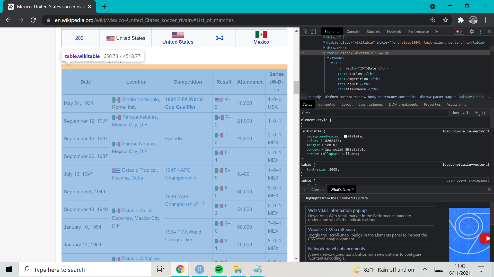

After watching the [highlights](https://youtu.be/Wig95n7_lks) of the inaugural Men's Nations League Final between the USA and Mexico, and learning that the USMNT's last competitive win over Mexico happened in [2013](https://youtu.be/2fc7Phg7sec), I wanted to investigate how competitive the rivalry has been over the years. As a newer fan of the USMNT, watching competitive matches against Mexico has always been a frustrating experience, but this game proved to be an outlier so far. Using data from Wikipedia, we will see that my experience doesn't differ much from that of long-term fans of the USMNT.

## Using {rvest} to Scrape Table Data from Wikipedia
When first brainstorming where to get the proper data for this exercise, my first thought was to use the [{worldfootballR}](https://github.com/JaseZiv/worldfootballR) package to pull and combine different data sets from [FBref](https://fbref.com/en/). While that pursuit started out to be promising, after looking at the [Mexico-United States soccer rivalry Wikipedia page](https://en.wikipedia.org/wiki/Mexico%E2%80%93United_States_soccer_rivalry), I figured scraping data from that page would be much easier. While there are plenty of ways to scrape data from websites with R, [{rvest}](https://rvest.tidyverse.org/) seemed to be the most popular and simplest package to use from my research. In order to install the package, we can install {tidyverse}, as {rvest} is a part of the {tidyverse}.


```{r, warning=FALSE, message=FALSE, results='hide', eval=FALSE}
# installing {tidyverse}
install.packages("tidyverse")
```

After installing either {rvest} or {tidyverse}, the data scraping process is quite simple. Before we write any more code, we need to identify the URL for the website we want to scrape from. In my case, the URL for the website I'm scraping from is https://en.wikipedia.org/wiki/Mexico%E2%80%93United_States_soccer_rivalry#List_of_matches, as shown below.


Next, we need to find the XPath for the html code of the table we want to scrape data from. This can be done by opening developer tools (Ctrl + Shift + I), enabling the inspect element tool (Ctrl + Shift + C), and clicking on the desired table. Now, as we click or scroll across the webpage, the html code in the developer tools box is going to shift to the code associated with the part of the webpage we're on. Finding the exact line of code with the inspect element tool is going to be difficult, but we can get to the right place by clicking on an element of the desired table, and scrolling up on the html code until we find something like __<table class = "wikitable>"__. It will look similar to the image below.



Once we find this specific location, we can simply right-click on the __<table class = "wikitable>"__ portion of the code, and copy the full XPath. Now that we have the URL for the website we're scraping from, and the XPath to the HTML code for the table we're scraping from, we only need a few lines of code to scrape the data. First, we're going to use the [read_html()](https://xml2.r-lib.org/reference/read_xml.html) function to read in the HTML content of our website. Next, we'll use the combination of [html_nodes()](https://rvest.tidyverse.org/reference/html_nodes.html) and [html_table()](https://rvest.tidyverse.org/reference/html_table.html) to locate the HTML node for our desired table and turn it into a dataframe.


```{r, warning=FALSE, message=FALSE, results='hide'}
# loading in {rvest} and/or {tidyverse}
library(rvest)
library(tidyverse)

# reading in HTML code of desired website
url <- "https://en.wikipedia.org/wiki/Mexico%E2%80%93United_States_soccer_rivalry#List_of_Matches_2"
webpage <- read_html(url)

# parsing html table into a list
data <- webpage %>%
  html_nodes(xpath = '/html/body/div[3]/div[3]/div[5]/div[1]/table[7]') %>%
  html_table()  

# list to dataframe
data <- data[[1]]
```

Before we start to work with our scraped data, we should analyze our new dataframe and confirm we scraped the correct data and that it's in a workable format. We can do this by simply checking out the head of the data, as shown below.


From this look at our dataframe, we can quickly confirm if we scraped the correct data or not, and if our dataframe is in a format we can work with. The only concern we might have is that all of our data is classified as characters (chr), also known as strings, but this is something we can easily modify before we start to work with the data.

## A Quick Visualization: USMNT-Mexico All-Time Results

Before working on a visualization of all-time results between the USMNT and Mexico, I first needed to manipulate some of the data, specifically creating columns that would allow me to determine the output of each game.

```{r}
# only using data up to nations league final
data <- data[c(1:71), ]

# adding friendly indicator, result indicator, and score columns
data <- data %>%
  mutate(Friendly = Competition == "Friendly", 
         US = c(4,2,3,1,0,0,2,0,1,0,2,3,0,2,0,1,1,0,1,0,0,0,0,0,1,2,
                1,2,2,0,1,1,4,0,2,0,2,0,0,1,1,3,2,2,0,1,2,0,1,1,2,2,
                2,2,2,0,1,2,1,1,0,2,2,2,2,1,1,1,0,0,3),
         Mexico = c(2,7,7,5,5,6,6,4,3,6,7,3,3,2,2,3,2,2,3,1,2,0,3,3,  
                    5,1,2,2,0,4,1,0,0,0,2,2,2,0,1,2,1,0,0,0,1,0,0,0,
                    0,2,0,0,1,2,0,5,2,4,1,0,0,0,2,0,2,2,1,0,1,3,2),
         ResIndicator = case_when( 
           US > Mexico ~ 1,
           US == Mexico ~ 0,
           US < Mexico ~ -1),
         Game_Num = 1:71,
         Date = str_sub(Date, -4))
```

Now that I have the result indicator column, I can make an interesting visualization showcasing all-time results. I'm not sure if there's a specific name for this type of visualization, but it's fairly easy to understand what's going on. 

```{r, echo=FALSE, fig.height=1.5, fig.width=10, warning=FALSE}
data %>%
  ggplot(aes(x = 1:nrow(data), y = ResIndicator, shape = Friendly)) +
  scale_shape_manual(values = c(1, 19),
                     breaks = c("FALSE", "TRUE"),
                     labels = c("Competitive", "Friendly")) +
  geom_segment(aes(x = Game_Num, xend = Game_Num, y = 0, yend = ResIndicator), 
               size = 1, color = factor(ifelse(data$ResIndicator > 0, "#3C3B6E", "#006341"))) +
  geom_point(color = factor(case_when(
    data$ResIndicator > 0 ~ "#B22234",
    data$ResIndicator == 0 ~ "white",
    data$ResIndicator < 1 ~ "#CE1126")),
    size = 3) +
  ylim(-1.3, 1.3) +
  theme(axis.title = element_blank(),
        axis.ticks = element_blank(),
        axis.text = element_blank(),
        plot.title = element_text(color = "white"),
        plot.caption = element_text(color = "white", hjust = 1.15),
        panel.grid = element_blank(),
        panel.background = element_rect(fill = "black", colour = "white"),
        plot.background = element_rect(fill = "black", colour = "black"),
        legend.background = element_rect(fill = "black", colour = "white"),
        legend.title = element_blank(),
        legend.text = element_text(color = "white")) +
  labs(title = "USA-Mexico All-Time Results Map (1934-2021)",
       caption = "Data Source: Wikipedia")
        
```

